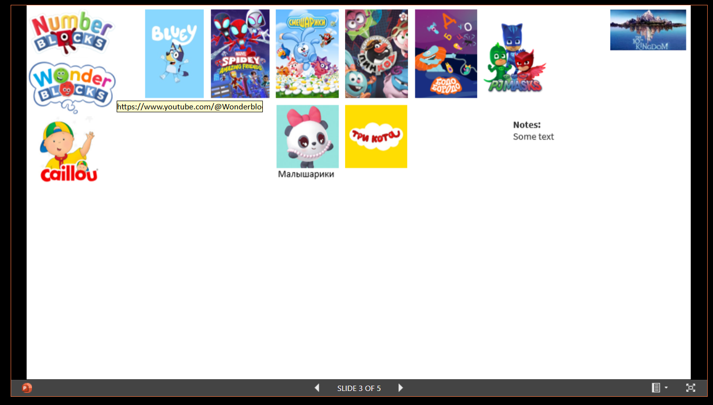
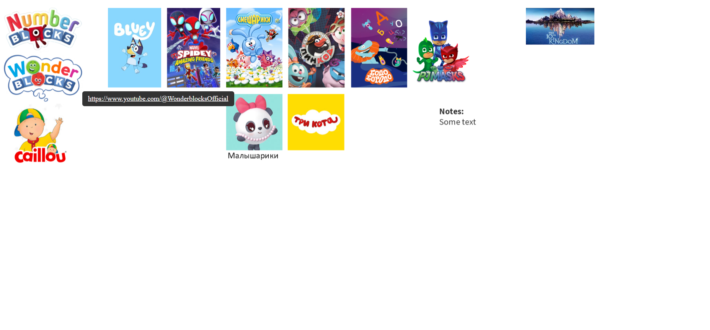

# ppt-render-html
## Why  
I needed a simple local home web page which could be edited in a graphical WYSIWYG way, for a kid-friendly dashboard.    
  
Here's one way: create a PowerPoint presentation, embed it into a simple html page, and voilà!  
  
Several problems, though.  
	1) Microsoft did not care about high-resolution screens. So what looks like a crisp image in PowerPoint turns into a blurred embarassment in the embedding.  
	2) The resulting page is not adaptive at all. The dimensions are fixed.  
  3) Microsoft can change the link to the shared presentation, or the embedding stops working altogether.    
All in all, not the greatest feeling when interacting with the page.  
<p align="center">
  
</p>  
<p align="center">
  
</p>  

I wanted something like ppt exported to html, but this functionality has been long gone from PowerPoint.  
  
An appealing alternative would be using Miro. But their link buttons look cluttered to me and they can't be disabled. Plus, you can't link on the object itself, only on the associated link button.  
<p align="center">
  
</p>  
  
A long time ago, in a country far, far away, in a post not saved by Web Archive, I read a nice write-up by Miro that described how they migrated rendering of their content to HTML canvas.  
So I decided to make my own export of slides to HTML canvas.  
  
Main requirements:  
	1) The page is 100% identical visually to the original slide  
	2) Links are clickable  
	3) The page scales to the window  
  4) The page is rendered taking the high resolution screen into account   
  <p align="center">
  
</p>  

## User guide
### Project structure  
```
/
├── script/
│   ├── Export-Slides.ps1         # Main script that performs slide export
│   ├── Run-Export-Slides.ps1     # Wrapper script to run with config file
│   └── param/
│       └── Params.ps1            # Parameters file with paths
│
├── templates/
│   ├── slide.html                # HTML template
│   ├── mainScript.js             # JavaScript template
│   └── style.css                 # Shared CSS
│
├── output/
│   └── slide_1.html, slide_1.png, slide_1_data.js, etc.
```
### Requirements  
1. PowerShell 5.x+  
2. Microsoft PowerPoint (for COM automation)  
3. Windows OS  

### How to run the export  
#### Using the wrapper
1. Define Parameters in /script/param/Params.ps1:
```
$pptxPath = "C:\ppt-render-html\input\HomeSite.pptx"
$outputPath = "C:\ppt-render-html\output"
$templatePath = "C:\ppt-render-html\templates"
```
2. Run from Terminal:  
Navigate to the project root folder, then:  
```
.\script\Run-Export-Slides.ps1
```
Or use a custom parameter file:
```
.\script\Run-Export-Slides.ps1 -p "C:\ppt-render-html\script\myParams.ps1"
```

#### Passing parameters directly into the main export script  
1. Run from Terminal:  
Navigate to the project root folder, then:  
```
.\script\Export-Slides.ps1 -p "C:\ppt-render-html\input\HomeSite.pptx" -o "C:\ppt-render-html\output" -t "C:\ppt-render-html\templates"
```
